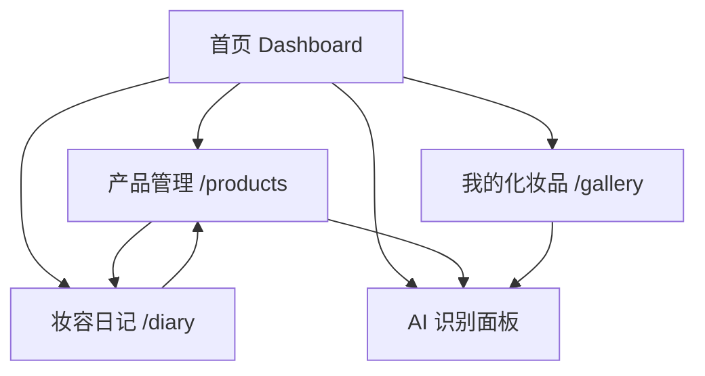

# Beauty Mirror

Beauty Mirror 是一个 AI 美妆与形象管理全栈小项目，前端使用 React + Vite，后端使用 Flask + SQLAlchemy，支持化妆品管理、妆容日记记录、图片上传、AI 拍照识别（可插拔框架）和首页统计概览。

## 功能

- **首页统计**：展示化妆品总数、日记总数、本月新增数量、最近添加的产品和最新日记，快速添加入口（📸拍照识别 / 🖼️相册识别）
- **化妆品管理**：支持新增、编辑、删除、搜索和分类筛选，支持图片上传
- **妆容日记**：支持新增、编辑、删除，可关联已添加的化妆品，记录妆容和心情
- **我的化妆品**：网格卡片浏览已保存的化妆品图片，按分类浏览
- **AI 识别框架**：拍照或相册选图后进行 AI 识别（当前为可插拔占位，后续接入 Claude Vision / GPT-4V 只需修改 `backend/recognizer.py` 一个文件），识别面板支持结果编辑 + 搜索官网宣传图

## 页面效果

项目整体是移动端优先的卡片式界面，主色调偏粉色（粉绿主题），底部固定 Tab 导航，适合在手机浏览器里直接使用。

- **首页** `/`：统计卡片 + 最近产品 + 最新日记 + 拍照/相册快速入口
- **产品管理** `/products`：搜索 + 分类筛选 + 弹层表单，集中管理化妆品条目
- **我的化妆品** `/gallery`：网格卡片展示产品图片，浏览体验直观
- **妆容日记** `/diary`：记录每日妆容、心情和搭配产品，可回看历史



## 技术栈

| 层级 | 技术 |
|------|------|
| 前端框架 | React 18 + Vite |
| 路由 | React Router v6 |
| HTTP | Axios |
| 后端框架 | Flask |
| ORM | Flask-SQLAlchemy |
| 数据库 | SQLite（默认），支持切换 MySQL / PostgreSQL |
| 图片处理 | Pillow |
| AI 识别 | 可插拔框架（`backend/recognizer.py`） |
| 部署 | 后端 Render / 前端 Vercel（已配置） |

## 项目结构

```text
beauty_mirror/
├── backend/
│   ├── app.py              # Flask 应用，所有 API 路由
│   ├── models.py           # Product & Diary 数据模型
│   ├── config.py           # 数据库配置（支持多数据库）
│   ├── recognizer.py       # AI 识别模块（可插拔，当前返回空结果）
│   ├── requirements.txt    # Python 依赖
│   └── Procfile            # Render/云平台部署入口
├── frontend/
│   ├── src/
│   │   ├── App.jsx         # 路由定义（4 个页面 + 404 兜底）
│   │   ├── api.js          # API 封装 + getPhotoUrl 图片地址工具
│   │   ├── pages/
│   │   │   ├── Dashboard.jsx       # 首页统计 + 快速入口
│   │   │   ├── ProductManage.jsx   # 产品管理（搜索/筛选/增删改）
│   │   │   ├── MyCosmetics.jsx     # 画廊浏览（网格卡片）
│   │   │   └── MakeupDiary.jsx     # 妆容日记（记录/关联产品）
│   │   ├── components/
│   │   │   ├── Layout.jsx          # 布局 + 底部 Tab 导航
│   │   │   ├── ProductForm.jsx     # 产品表单弹层
│   │   │   ├── DiaryForm.jsx       # 日记表单弹层
│   │   │   ├── ProductCard.jsx     # 产品卡片组件
│   │   │   ├── DiaryCard.jsx       # 日记卡片组件
│   │   │   └── RecognizePanel.jsx  # AI 识别面板（拍照/识别/确认）
│   │   └── styles/
│   │       └── index.css           # 全局样式
│   ├── index.html
│   ├── vite.config.js
│   └── vercel.json         # Vercel 部署配置
├── render.yaml             # Render 部署配置
├── README.md
└── WEEKLY_REPORT.md        # 项目周报
```

## 运行环境

- Python 3.10+
- Node.js 18+
- npm

## 本地运行

项目需要同时启动后端和前端。

### 1. 启动后端

在项目根目录执行：

```powershell
python -m venv .venv
.\.venv\Scripts\Activate.ps1
pip install -r backend\requirements.txt
python backend\app.py
```

后端默认运行在：

- http://127.0.0.1:5000

首次启动时会自动创建数据库文件和上传目录。

### 2. 启动前端

另开一个终端，在项目根目录执行：

```powershell

```

前端默认运行在：

- http://127.0.0.1:3000

前端已经配置了代理，`/api` 和 `/uploads` 会转发到后端，本地开发时不用手动改接口地址。

## 部署

### 后端部署到 Render

后端已配置 `render.yaml`，可直接在 Render 中导入此仓库：

- **Root Directory**: `backend`
- **Build Command**: `pip install -r requirements.txt`
- **Start Command**: `gunicorn app:app --bind 0.0.0.0:$PORT --timeout 120`
- **Python Version**: 3.11.9

### 前端部署到 Vercel

1. 在 Vercel 中导入此仓库，Root Directory 选择 `frontend`
2. Build Command 填 `npm run build`，Output Directory 填 `dist`
3. 在 Vercel 的 Environment Variables 中添加：
   - `VITE_API_BASE_URL = https://你的后端地址/api`
4. 部署完成后，前端会通过该地址访问后端接口

> 当前前端已通过 `getPhotoUrl()` 工具函数处理图片地址，生产和开发环境自动切换。

## API 接口

| 方法 | 路径 | 说明 |
|------|------|------|
| GET | `/api/dashboard` | 首页统计数据 |
| GET | `/api/products` | 获取产品列表 |
| POST | `/api/products` | 新增产品 |
| PUT | `/api/products/<id>` | 编辑产品 |
| DELETE | `/api/products/<id>` | 删除产品 |
| GET | `/api/diary` | 获取日记列表 |
| POST | `/api/diary` | 新增日记 |
| PUT | `/api/diary/<id>` | 编辑日记 |
| DELETE | `/api/diary/<id>` | 删除日记 |
| POST | `/api/recognize` | AI 识别产品（可插拔） |

图片访问地址以 `/uploads/<type>/<filename>` 形式提供。

## 配置说明

后端配置位于 [backend/config.py](backend/config.py)。

- 默认使用 SQLite，数据库文件保存在 `backend/instance/beauty.db`
- 如果设置了 `DATABASE_URL`，会优先使用该地址
- 如果设置了 MySQL 相关环境变量，则会切换到 MySQL

可用环境变量：

| 变量 | 说明 |
|------|------|
| `DATABASE_URL` | 完整数据库连接地址 |
| `MYSQL_HOST` | MySQL 主机 |
| `MYSQL_PORT` | MySQL 端口 |
| `MYSQL_USER` | MySQL 用户名 |
| `MYSQL_PASSWORD` | MySQL 密码 |
| `MYSQL_DB` | MySQL 数据库名 |
| `SECRET_KEY` | Flask 密钥 |
| `PORT` | 后端端口（云部署用） |

## AI 识别扩展

AI 识别采用可插拔设计。当前 `backend/recognizer.py` 返回空结果，识别面板引导用户手动填写。后续接入 AI 只需修改一个函数：

```python
# backend/recognizer.py
def recognize_product(image_bytes):
    # 接入 Claude Vision / GPT-4V / 其他 AI
    return {
        "brand": "识别品牌",
        "name": "产品名称",
        "category": "分类",
        "color": "色号",
        "confidence": 0.95,
    }
```

前端 `RecognizePanel` 会自动展示识别结果，用户可编辑确认后保存。

## 版本标签

- `v1-green-pink`：粉绿版 Beauty Mirror（commit `78e1435`），完整可用

## 说明

- 前端页面路由由 [frontend/src/App.jsx](frontend/src/App.jsx) 定义
- 数据模型定义在 [backend/models.py](backend/models.py)，产品和日记都支持图片字段
- 建议保留 `.gitignore` 中对 `frontend/node_modules/`、`frontend/dist/`、`backend/__pycache__/` 和 `instance/` 的忽略规则
cd frontend
npm install
npm run dev