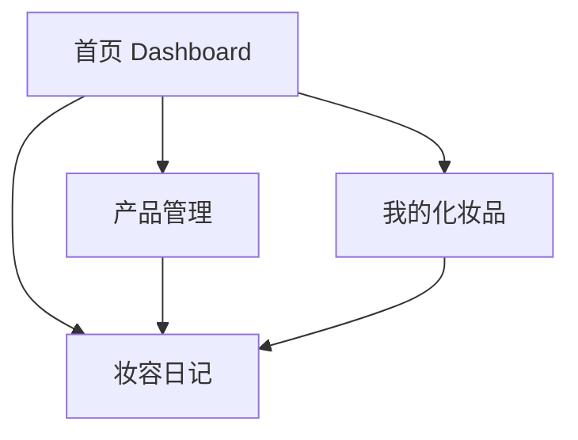

# Beauty Mirror

Beauty Mirror 是一个用于管理化妆品和妆容日记的全栈小项目，前端使用 React + Vite，后端使用 Flask + SQLAlchemy，支持化妆品管理、妆容日记记录、图片上传和首页统计概览。

## 功能

- 首页统计：展示化妆品总数、日记总数、本月新增数量、最近添加的产品和最新日记。
- 化妆品管理：支持新增、编辑、删除、搜索和分类筛选。
- 妆容日记：支持新增、编辑、删除，并可关联已添加的化妆品。
- 我的化妆品：按分类浏览已保存的化妆品卡片。
- 图片上传：产品和日记都支持上传图片，并在页面中展示。

## 页面效果

项目整体是移动端优先的卡片式界面，主色调偏粉色，底部固定 Tab 导航，适合在手机浏览器里直接使用。

- 首页：展示统计卡片、最近添加的产品和最新日记，方便快速查看当前数据。
- 产品页：支持搜索、分类筛选和弹层表单，适合集中管理化妆品条目。
- 画廊页：以网格卡片展示化妆品图片，浏览体验更直观。
- 日记页：记录每日妆容、心情和搭配产品，可回看历史记录。

如果你要把它放到 GitHub 首页展示，建议后续补 3 到 4 张截图，分别对应首页、产品管理、画廊和日记页面。



## 技术栈

- 前端：React、React Router、Axios、Vite
- 后端：Flask、Flask-SQLAlchemy、Flask-CORS、Pillow
- 数据库：本地默认使用 SQLite，也支持通过环境变量切换到 MySQL 或其他数据库

## 项目结构

```text
beauty_mirror/
├─ backend/
│  ├─ app.py
│  ├─ config.py
│  ├─ models.py
│  └─ requirements.txt
├─ frontend/
│  ├─ package.json
│  ├─ vite.config.js
│  └─ src/
└─ README.md
```

## 运行环境

- Python 3.10+
- Node.js 18+
- npm

## 本地运行

项目需要同时启动后端和前端。

### 1. 启动后端

在项目根目录执行：

```powershell
python -m venv .venv
.\.venv\Scripts\Activate.ps1
pip install -r backend\requirements.txt
python backend\app.py
```

后端默认运行在：

- http://127.0.0.1:5000

首次启动时会自动创建数据库文件和上传目录。

### 2. 启动前端

另开一个终端，在项目根目录执行：

```powershell
cd frontend
npm install
npm run dev
```

前端默认运行在：

- http://127.0.0.1:3000

前端已经配置了代理，`/api` 和 `/uploads` 会转发到后端，所以本地开发时不用手动改接口地址。

## Vercel 部署

Vercel 更适合部署前端静态站点。这个项目如果要上 Vercel，推荐采用“前端部署到 Vercel，后端部署到其他支持 Flask 的平台”的方式。

### 方案一：前端部署到 Vercel，后端单独部署

1. 先把后端部署到 Render、Railway、Fly.io 或你自己的云服务器上，并拿到一个公网地址，例如 `https://your-backend.example.com`。
2. 在 Vercel 中导入这个仓库，Root Directory 选择 `frontend`。
3. Build Command 填 `npm run build`，Output Directory 填 `dist`。
4. 在 Vercel 的 Environment Variables 中添加：
	- `VITE_API_BASE_URL = https://your-backend.example.com/api`
5. 部署完成后，前端会通过这个地址访问后端接口。

当前前端已经支持通过 `VITE_API_BASE_URL` 配置接口地址；如果不设置，默认仍会请求本地的 `/api`。

### 方案二：只部署前端做演示

如果你只是想让页面先跑起来，可以把前端单独部署到 Vercel，但这时接口仍然需要一个可用的后端地址，否则页面里的产品和日记数据无法正常读写。

### Vercel 路由说明

项目使用的是 React Router 的浏览器路由，已经在 [frontend/vercel.json](frontend/vercel.json) 中配置了重写规则，确保刷新 `/products`、`/gallery`、`/diary` 等页面时不会出现 404。

### 部署注意事项

- Vercel 本身不适合直接运行当前这套 Flask 后端；后端最好单独部署。
- 图片上传接口依赖后端的 `/uploads` 静态访问能力，所以后端部署后要保证该路径可公开访问。
- 如果你后面想把后端也改成 Vercel Serverless Functions，需要把 Flask 结构重构成 Vercel 可识别的 API 目录，这会比当前方案改动更大。

## 配置说明

后端配置位于 [backend/config.py](backend/config.py)。

- 默认使用 SQLite，数据库文件会保存在 backend/instance/beauty.db
- 如果设置了 `DATABASE_URL`，会优先使用该地址
- 如果设置了 MySQL 相关环境变量，则会切换到 MySQL

可用环境变量如下：

- `DATABASE_URL`
- `MYSQL_HOST`
- `MYSQL_PORT`
- `MYSQL_USER`
- `MYSQL_PASSWORD`
- `MYSQL_DB`
- `SECRET_KEY`
- `PORT`

## 接口概览

后端主要接口包括：

- `GET /api/dashboard`
- `GET /api/products`
- `POST /api/products`
- `PUT /api/products/<id>`
- `DELETE /api/products/<id>`
- `GET /api/diary`
- `POST /api/diary`
- `PUT /api/diary/<id>`
- `DELETE /api/diary/<id>`

图片访问地址以 `/uploads/...` 形式提供。

## 说明

- 前端页面入口由 [frontend/src/App.jsx](frontend/src/App.jsx) 定义，包含首页、产品、画廊和日记四个页面。
- 数据模型定义在 [backend/models.py](backend/models.py)，产品和日记都支持图片字段。
- 如果你已经在仓库里安装过依赖，建议保留 `.gitignore` 中对 `frontend/node_modules/`、`frontend/dist/`、`backend/__pycache__/` 和 `instance/` 的忽略规则。
